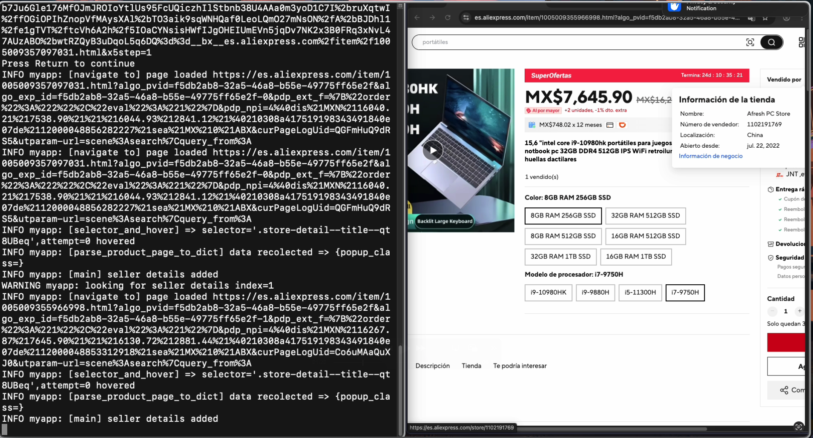
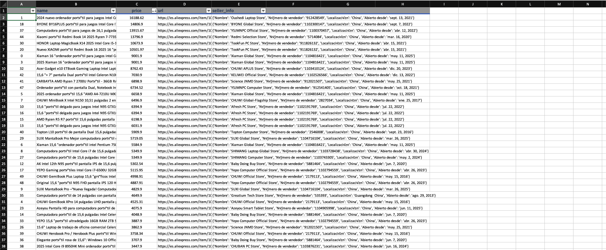
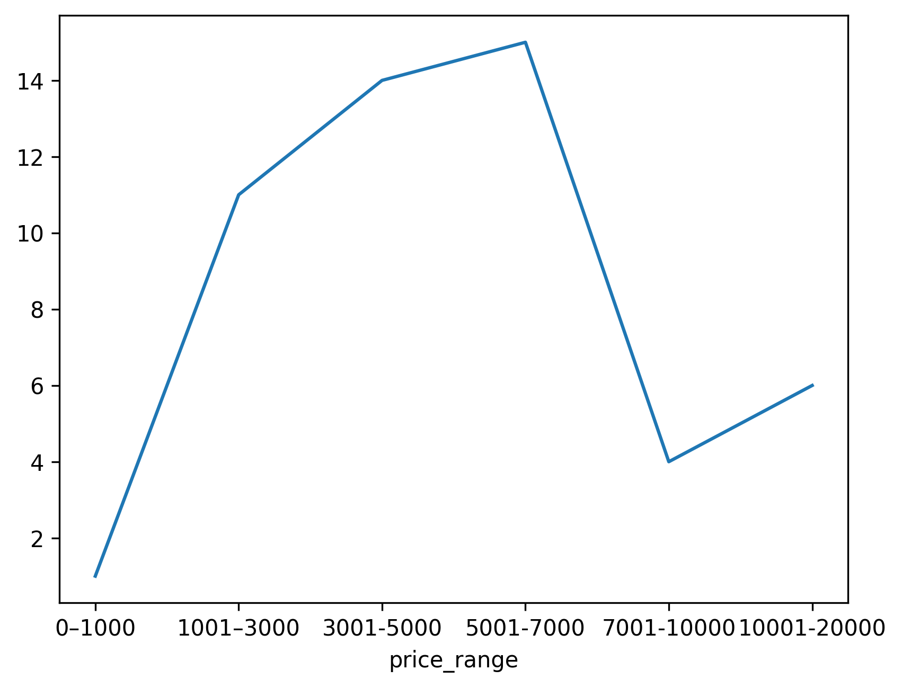

# Web-Scraping Demos 
*Python · Selenium · BeautifulSoup · pandas Web-Scraping-Demos

[](https://www.python.org/)


Need to learn how to extract data from modern websites?
This repo shows **three self-contained examples**—static HTML, infinite scroll,
and pagination with filters—each exporting clean CSV/JSON.


## Table of Contents
- [Quickstart](#quickstart)
- [Demo Line-up](#available-scrapers)
- [AliExpress Scrapper](#aliexpress-scrapper)
- [Links & Contact](#links--contact)

---

## Quickstart
Clone the repository and install all dependencies:

```bash
git clone https://github.com/you/web-scraping-demos.git
cd web-scraping-demos
pip install -r requirements.txt
```

run the AliExpress scraper:
```bash
python python -m aliexpress
```

---


## Demo Line-up
| Demo | Target | Techniques | Key Output |
|------|--------|------------|------------|
| [AliExpress Scrapper](#aliexpress-scrapper) | Infinite-scroll product list | Selenium + dynamic waits | 4 columns (name, price, URL, seller) |

---


##  AliExpress Scrapper
**Scrapes AliExpress search results for product and seller data**

1. Launch headless Chrome → infinite-scroll all cards  
2. Parse product name, price, link, seller rating  
3. Save to `results/aliexpress.csv`
4. Analysis and plot of prices.


<div align="center">
  
  
</div>

<div align="center">
  
</div>
## Links & Contact
- **CSV Outputs:** [Results folder](https://github.com/Kikve/web-scraping-demos/tree/main/documents)
- **Notebooks:**
  - [AliExpress Analysis](https://github.com/Kikve/web-scraping-demos/tree/main/notebooks)
- **Repo:** https://github.com/Kikve/web-scraping-demos
- **Contact:** enriquevh.dev@gmail.com 
